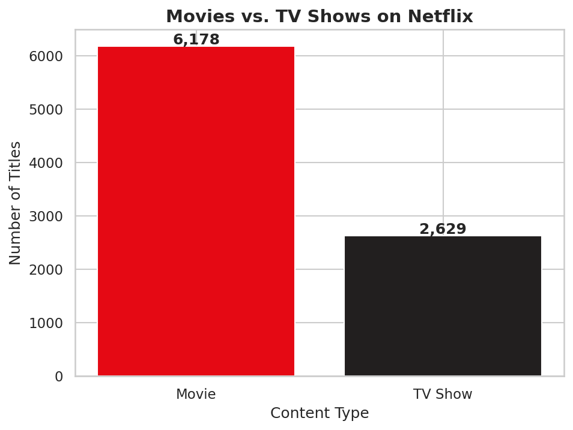
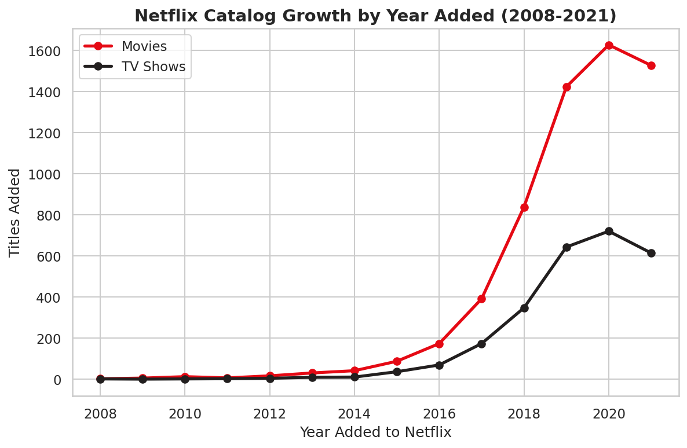
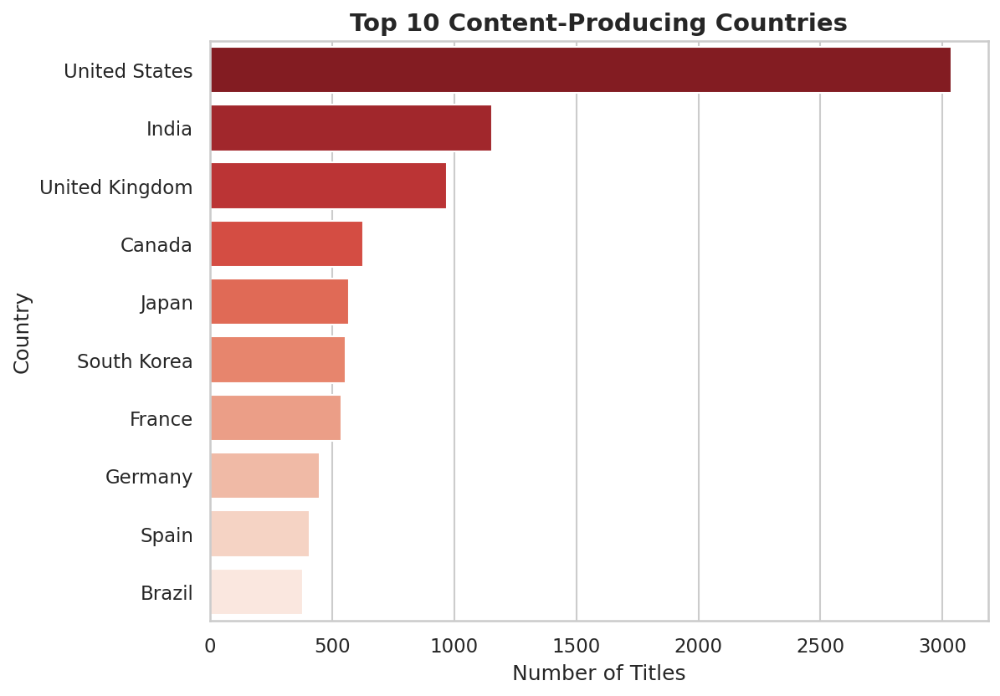
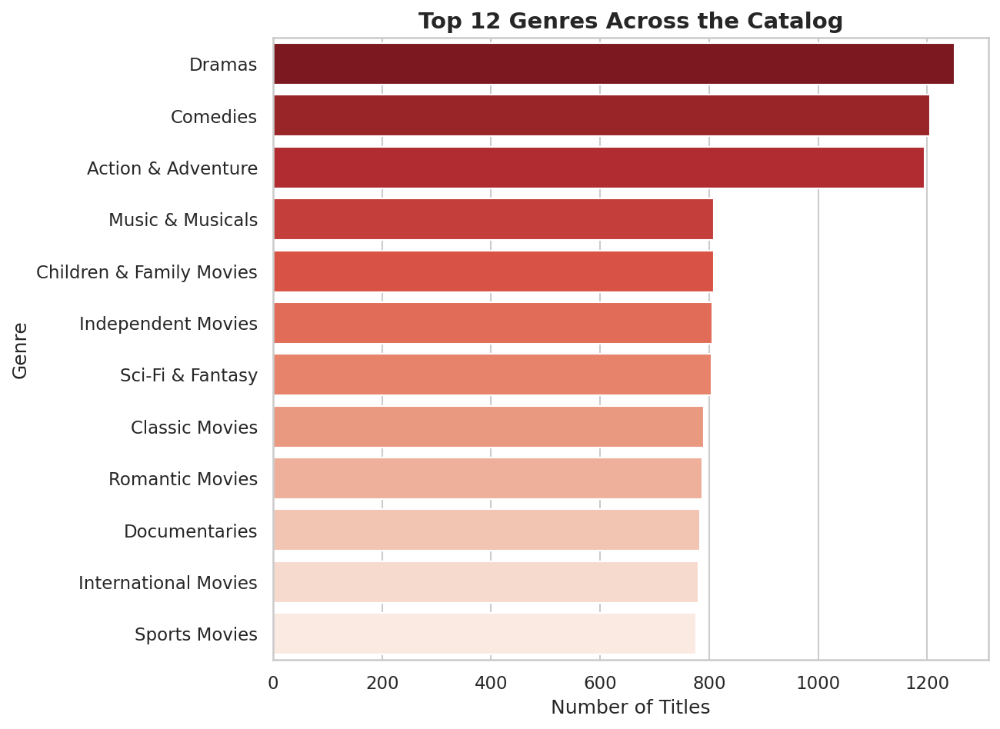
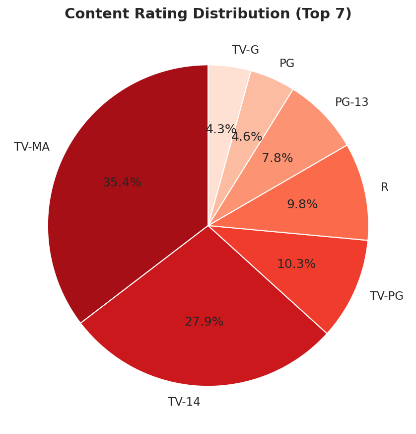
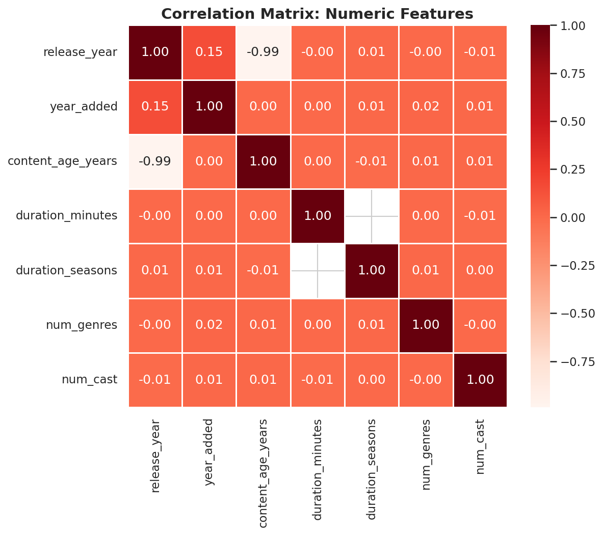

# 🎬 Netflix Data Analysis using Python


A complete, end-to-end data analyst portfolio project: cleaning, exploring,
visualizing, and extracting business insights from an 8,807-title
Netflix-style content catalog — fully reproducible, from raw CSV to
executive-ready recommendations.

---

## 📌 Project Overview

Streaming platforms live and die by their content strategy. This project
puts on a Data Analyst hat inside a fictional "Netflix Content Strategy"
team and answers the questions leadership actually asks: *Where should we
invest next? Is our growth slowing? Are we too skewed toward mature
content? Which markets and creators are carrying the catalog?*

The project covers the **full analyst lifecycle**: data understanding,
cleaning, feature engineering, 30+ exploratory analyses, 15 professional
visualizations, and a business-insights report — all built on a realistic,
purpose-engineered dataset and validated by actually running every script
and notebook, not just writing them.

## 🎯 Business Problem

> A streaming platform's content team needs a data-driven view of their
> catalog to guide 2022 content investment: which genres, countries, and
> formats are working, where growth is heading, and where the content
> metadata itself needs cleanup before it can power personalization.

## 🎯 Objectives

- Profile and clean a large, realistically messy content catalog
- Engineer features that support time-series, geographic, and format-level analysis
- Answer 30+ concrete business questions with real computed evidence
- Produce professional, recruiter-ready visualizations and documentation
- Package everything as a reproducible, GitHub-ready repository

## 📊 Dataset

`dataset/netflix_titles.csv` — **8,807 rows**, a synthetic, Netflix-schema
content catalog engineered with realistic business patterns baked in
(exponential catalog growth 2008-2021, Dec/Jan/Jul seasonality, Pareto-
distributed countries and directors, mature-content skew, single-season-show
dominance). See [`data_generation/generate_dataset.py`](data_generation/generate_dataset.py)
for exactly how — and why — it's synthetic rather than scraped.

| Column | Type | Description |
|---|---|---|
| `show_id` | string | Unique identifier for the title |
| `type` | string | `Movie` or `TV Show` |
| `title` | string | Title name |
| `director` | string | Credited director(s); often missing for TV shows |
| `cast` | string | Comma-separated credited cast |
| `country` | string | Comma-separated production countr(y/ies) |
| `date_added` | string → datetime | Date the title was added to the platform |
| `release_year` | int | Original release year |
| `rating` | string | Content/audience rating (e.g. `TV-MA`, `PG-13`) |
| `duration` | string | `"X min"` for movies, `"X Season(s)"` for TV shows |
| `listed_in` | string | Comma-separated genre tags |
| `description` | string | Short synopsis |

## 🛠️ Technology Stack

Python 3.11+ · Pandas · NumPy · Matplotlib · Seaborn · Plotly · SciPy ·
Jupyter Notebook · Git/GitHub

## 📁 Project Structure

```
Netflix-Data-Analysis/
├── README.md
├── requirements.txt
├── .gitignore
├── LICENSE
├── dataset/
│   ├── netflix_titles.csv            # raw synthetic catalog
│   └── netflix_titles_clean.csv      # cleaned, feature-engineered output
├── data_generation/
│   ├── generate_dataset.py           # how the realistic dataset was built
│   └── build_notebooks.py            # how the notebooks were generated
├── notebooks/
│   ├── 01_data_cleaning.ipynb
│   ├── 02_exploratory_data_analysis.ipynb
│   ├── 03_visualizations.ipynb
│   └── 04_business_insights.ipynb
├── src/
│   ├── utils.py
│   ├── data_cleaning.py
│   ├── analysis.py
│   └── visualization.py
├── images/
│   ├── plots/                        # 13 PNGs + 2 interactive HTML charts
│   └── README_images.md
└── reports/
    ├── Business_Report.pdf
    ├── Insights.md                   # 30+ numbered, data-grounded insights
    ├── Project_Summary.md
    ├── computed_results.json         # machine-readable analysis output
    └── screenshots_placeholder.md
```

## ⚙️ Installation Guide

```bash
git clone https://github.com/<your-username>/Netflix-Data-Analysis.git
cd Netflix-Data-Analysis
python -m venv venv
source venv/bin/activate      # Windows: venv\Scripts\activate
pip install -r requirements.txt
```

## ▶️ How to Run

```bash
# 1. Clean the raw dataset (writes dataset/netflix_titles_clean.csv)
python src/data_cleaning.py

# 2. Run every analysis and dump results to reports/computed_results.json
python src/analysis.py

# 3. Generate every chart into images/plots/
python src/visualization.py

# or explore interactively:
jupyter notebook notebooks/
```

## 🔄 Analysis Workflow

1. **Data Understanding** — shape, dtypes, missingness, duplicates, memory footprint
2. **Data Cleaning** — dedup, missing-value strategy, data-quality-defect fix, date parsing
3. **Feature Engineering** — 12 derived columns (age, decade, primary genre/country, etc.)
4. **Exploratory Data Analysis** — 30+ business-question-driven analyses
5. **Visualization** — 13 static charts + 2 interactive Plotly charts
6. **Business Insights** — 30+ recommendations tied to real computed numbers

## 📈 Visualizations

| | | |
|---|---|---|
|  |  |  |
|  |  |  |

See [`images/README_images.md`](images/README_images.md) for the full chart
index, including two interactive Plotly charts (open the `.html` files
directly in a browser).

## 💡 Business Insights (Highlights)

- Movies make up **70.1%** of the catalog vs. **29.9%** TV shows.
- **61.8%** of content is international (non-US) — a genuinely global library.
- **42.4%** of titles carry a mature rating (TV-MA/R/NC-17).
- **73%** of TV shows never get renewed past a single season.
- Catalog additions grew from single digits (2008) to **1,750/year** (2020)
  before cooling — a maturing, not stalling, growth curve.
- December, January, and July are the platform's heaviest content-addition
  months.

Full list of 30+ insights with recommendations: [`reports/Insights.md`](reports/Insights.md)

## 🧠 Key Learnings

- Real-world "clean" catalog data still hides structural defects (a
  duration-into-rating column shift) that only a values/schema validation
  pass catches.
- Missing data isn't always a nuisance to drop — explicit `'Unknown'`
  flagging preserved full catalog volume for time-series analysis while
  keeping categorical breakdowns honest about coverage.
- Pareto concentration (a handful of countries/directors dominating volume)
  shows up repeatedly and is one of the most actionable patterns for a
  content-investment strategy.

## 🚀 Future Improvements

- Interactive Streamlit/Plotly Dash dashboard for live filtering by country, genre, and year
- Time-series forecasting of future catalog growth
- A simple content-based recommendation engine using genre/cast similarity
- Sentiment analysis if review/rating-score data were available

## 🙏 Acknowledgements

Dataset schema inspired by the publicly known structure of Netflix's title
catalog; all data in this repository is synthetically generated (see
`data_generation/generate_dataset.py`) and contains no real Netflix content,
titles, or descriptions.

## 📄 License

Released under the [MIT License](LICENSE).
